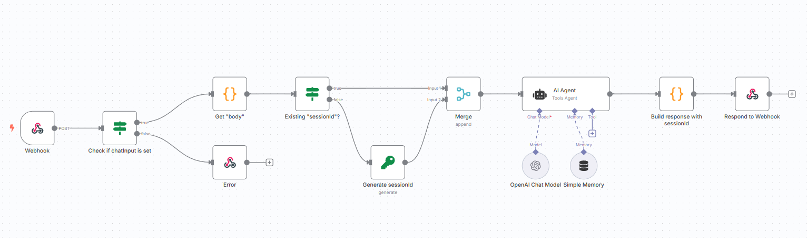

# 🤖 N8N Embedded Chat Interface

<div align="center">


**Extend your website with a chat interface for your n8n AI workflow!**

[🚀 Demo](#demo) • [📖 Documentation](#installation) • [🤝 Contributing](#contributing) • [💬 Community](#community)

</div>

---

## 🎯 What is this?

The **N8N Embedded Chat Interface** is a modern, embeddable native web component that enables you to integrate n8n workflows as interactive chatbots on any website. With just a few lines of HTML code, you can transform your n8n automations into user-friendly conversational interfaces.

### ✨ Key Features

- 🔌 **Plug & Play**: Easy integration with a single `<script>` tag + 1 line of HTML code
- 🌍 **Multilingual**: Internationalization (i18n) support (German, English)
- 📦 **Ready to host on your own domain**: You can host the bundle on your domain with zero other dependencies

## 🚀 Usage

Setup your website with the following code:

```html
<!-- Add these lines to your website -->
<script src="https://cdn.jsdelivr.net/npm/n8n-embedded-chat-interface@latest/output/index.umd.cjs"></script>

<n8n-embedded-chat-interface label="My AI Assistant" hostname="https://your-n8n-webhook.com/webhook/:id-of-your-webhook-node" open-on-start="false"> </n8n-embedded-chat-interface>
```

## 🔧 N8N Workflow Setup

### 1. Configure Webhook Node

Create a new workflow in n8n with a **Webhook** Trigger Node:

```json
{
	"httpMethod": "POST",
	"responseMode": "responseNode"
}
```

The body will look like this:

```json
{
	"chatInput": "Hello, how are you?",
	"sessionId": "xxx" // second message will have a sessionId
}
```

### 2. Implement Chat Logic

Add your chat logic (e.g., OpenAI, local AI, or custom logic).



### 3. Response Format

Your workflow must return the following JSON format:

```json
{
	"output": "Chatbot response",
	"sessionId": "session-id"
}
```

**That's it!** 🎉 Your website now has an intelligent chatbot.

## Local Build and development

```bash
git clone https://github.com/symbiosika/n8n-embedded-chat-interface
cd n8n-embedded-chat-interface
npm install
npm run build
npm run dev
```

## 🛠️ Configuration

### Basic Configuration

```html
<n8n-embedded-chat-interface label="Your Bot Name" description="Bot description" hostname="https://your-n8n-webhook-url.com" mode="n8n" open-on-start="false"> </n8n-embedded-chat-interface>
```

### Available Attributes

| Attribute       | Type   | Default   | Description                              |
| --------------- | ------ | --------- | ---------------------------------------- |
| `label`         | String | `""`      | Chat window title                        |
| `description`   | String | `""`      | Chatbot description (currently not used) |
| `hostname`      | String | `""`      | **Required**: URL to your n8n webhook    |
| `mode`          | String | `"n8n"`   | Chat mode (currently only n8n)           |
| `open-on-start` | String | `"false"` | Open chat on page load                   |

## 🗺️ Roadmap

### 🎯 Planned Features

- [ ] **Voice Chat**: Speech input and output
- [ ] **Image Generation**: Image generation with AI from a chat input

## 🤝 Contributing

We welcome every contribution! 🎉

<div align="center">

**Like the project? Give us a ⭐ on GitHub!**

[⭐ Star on GitHub](https://github.com/symbiosika/n8n-embedded-chat-interface) • [🐛 Report Bug](https://github.com/symbiosika/n8n-embedded-chat-interface/issues) • [💡 Request Feature](https://github.com/symbiosika/n8n-embedded-chat-interface/issues)

</div>
