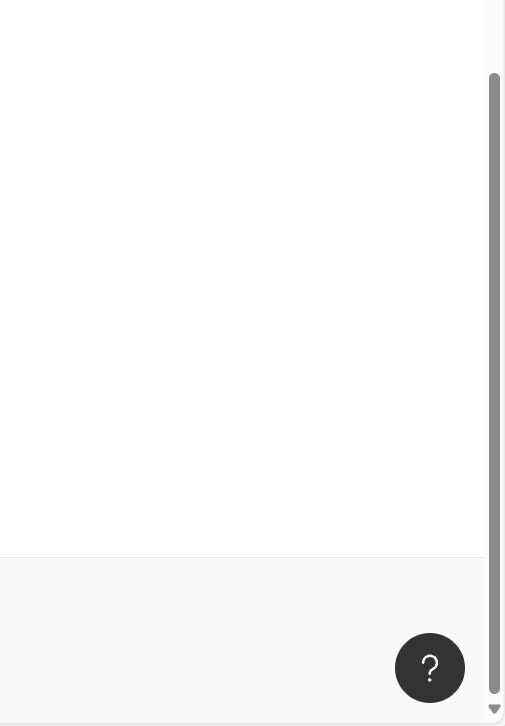

# 🤖 N8N Embedded Chat Interface

<div align="center">


**Extend your website with a chat interface for your n8n AI workflow!**

[🚀 Demo](#demo) • [📖 Documentation](#installation) • [🤝 Contributing](#contributing) • [💬 Community](#community)

</div>

---

## 🎯 What is this?

The **N8N Embedded Chat Interface** is a modern, embeddable native web component that enables you to integrate n8n workflows as interactive chatbots on any website. With just a few lines of HTML code, you can transform your n8n automations into user-friendly conversational interfaces.



### ✨ Key Features

- 🔌 **Plug & Play**: Easy integration with a single `<script>` tag + 1 line of HTML code
- 🌍 **Multilingual**: Internationalization (i18n) support (German, English)
- 📦 **Ready to host on your own domain**: You can host the bundle on your domain with zero other dependencies

## 🚀 Usage

Setup your website with the following code:

```html
<!-- Add these lines to your website -->
<script src="https://cdn.jsdelivr.net/npm/n8n-embedded-chat-interface@latest/output/index.js"></script>

<n8n-embedded-chat-interface label="My AI Assistant" hostname="https://your-n8n-webhook.com/webhook/:id-of-your-webhook-node" open-on-start="false"> </n8n-embedded-chat-interface>
```

## 🔧 N8N Workflow Setup

### 1. Configure Webhook Node

Create a new workflow in n8n with a **Webhook** Trigger Node:

```json
{
	"httpMethod": "POST",
	"responseMode": "responseNode"
}
```

The body will look like this:

```json
{
	"chatInput": "Hello, how are you?",
	"sessionId": "xxx" // second message will have a sessionId
}
```

### 2. Implement Chat Logic

Add your chat logic (e.g., OpenAI, local AI, or custom logic).


### 3. Response Format

Your workflow must return the following JSON format:

```json
{
	"output": "Chatbot response",
	"sessionId": "session-id"
}
```

**That's it!** 🎉 Your website now has an intelligent chatbot.

## Local Build and development

```bash
git clone https://github.com/symbiosika/n8n-embedded-chat-interface
cd n8n-embedded-chat-interface
npm install
npm run build
npm run dev
```

To run a demo please create a copy of "demo\index.html.sample" to "demo\index.html" and run:

```bash
npm run demo
```

Then open the Browser on:
http://localhost:8000/demo/

## 🛠️ Configuration

### Basic Configuration

```html
<n8n-embedded-chat-interface label="Your Bot Name" description="Bot description" hostname="https://your-n8n-webhook-url.com" mode="n8n" open-on-start="false"> </n8n-embedded-chat-interface>
```

### Available Attributes

| Attribute       | Type   | Default   | Description                              |
| --------------- | ------ | --------- | ---------------------------------------- |
| `label`         | String | `""`      | Chat window title                        |
| `description`   | String | `""`      | Chatbot description (currently not used) |
| `hostname`      | String | `""`      | **Required**: URL to your n8n webhook    |
| `mode`          | String | `"n8n"`   | Chat mode (currently only n8n)           |
| `open-on-start` | String | `"false"` | Open chat on page load                   |

### 🎨 Custom Color Schemes

You can customize the appearance of the chat interface by specifying custom colors. The component supports up to 10 different color properties:

```html
<n8n-embedded-chat-interface 
  label="Custom Themed Chat" 
  hostname="https://your-n8n-webhook.com"
  primary-color="#2563eb"
  secondary-color="#64748b"
  background-color="#f8fafc"
  text-color="#1e293b"
  accent-color="#3b82f6"
  surface-color="#ffffff"
  border-color="#e2e8f0"
  success-color="#16a34a"
  warning-color="#f59e0b"
  error-color="#dc2626"
  open-on-start="false">
</n8n-embedded-chat-interface>
```

#### Color Properties

| Property           | Description                           | Example Values                     |
| ------------------ | ------------------------------------- | ---------------------------------- |
| `primary-color`    | Primary brand color (buttons, header) | `#2563eb`, `rgb(37,99,235)`, `blue` |
| `secondary-color`  | Secondary accent color               | `#64748b`, `gray`, `hsl(215,25%,27%)` |
| `background-color` | Main background color                | `#f8fafc`, `white`, `#111827`      |
| `text-color`       | Primary text color                   | `#1e293b`, `black`, `#f9fafb`      |
| `accent-color`     | Highlight and accent elements        | `#3b82f6`, `rgb(59,130,246)`       |
| `surface-color`    | Cards and surface backgrounds        | `#ffffff`, `#1f2937`               |
| `border-color`     | Border and divider color             | `#e2e8f0`, `#374151`               |
| `success-color`    | Success messages and indicators      | `#16a34a`, `green`                 |
| `warning-color`    | Warning messages and indicators      | `#f59e0b`, `orange`                |
| `error-color`      | Error messages and indicators        | `#dc2626`, `red`                   |

#### Supported Color Formats

- **Hex colors**: `#ff0000`, `#f00`, `#ff0000ff`
- **RGB/RGBA**: `rgb(255,0,0)`, `rgba(255,0,0,0.5)`
- **HSL/HSLA**: `hsl(0,100%,50%)`, `hsla(0,100%,50%,0.5)`
- **Named colors**: `red`, `blue`, `transparent`, etc.

#### Security & Validation

All color values are automatically validated to prevent CSS injection attacks. Invalid color values will be ignored and logged as warnings in the browser console.

#### Example Themes

**Corporate Blue Theme:**
```html
<n8n-embedded-chat-interface 
  primary-color="#2563eb" 
  secondary-color="#64748b" 
  background-color="#f8fafc" 
  text-color="#1e293b"
  hostname="your-webhook-url">
</n8n-embedded-chat-interface>
```

**Dark Theme:**
```html
<n8n-embedded-chat-interface 
  primary-color="#3b82f6" 
  background-color="#111827" 
  text-color="#f9fafb" 
  surface-color="#1f2937"
  hostname="your-webhook-url">
</n8n-embedded-chat-interface>
```

## 🗺️ Roadmap

### 🎯 Planned Features

- [ ] **Voice Chat**: Speech input and output

## 🤝 Contributing

We welcome every contribution! 🎉

<div align="center">

**Like the project? Give us a ⭐ on GitHub!**

[⭐ Star on GitHub](https://github.com/symbiosika/n8n-embedded-chat-interface) • [🐛 Report Bug](https://github.com/symbiosika/n8n-embedded-chat-interface/issues) • [💡 Request Feature](https://github.com/symbiosika/n8n-embedded-chat-interface/issues)

</div>
